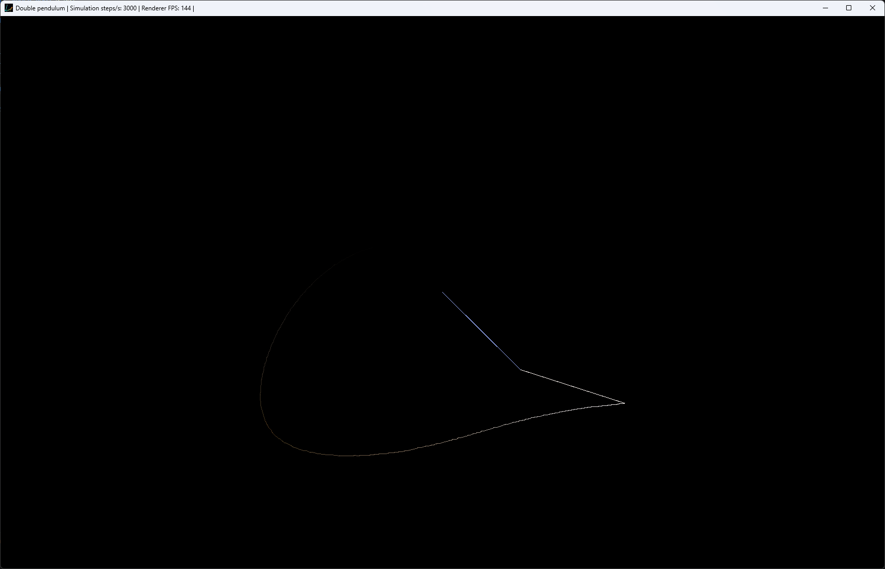
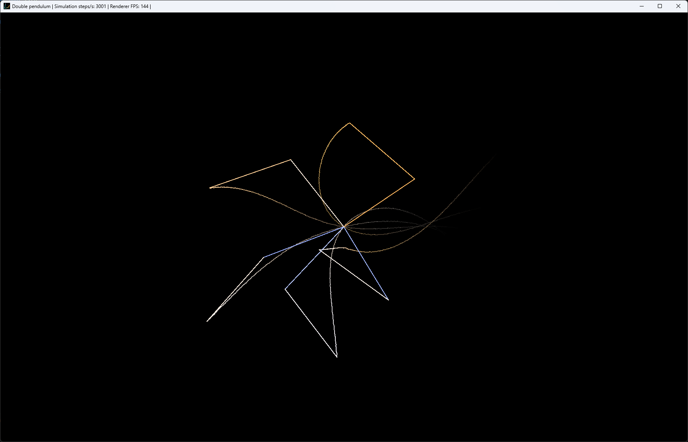

# DoublePendulum

## Overview

DoublePendulum is a real-time double pendulum simulation written in C11 and rendered with SDL2. The project focuses on visualizing chaotic motion, experimenting with numerical simulation, rendering a real-time physics system, and keeping the implementation lightweight enough to understand and modify.

## Preview





## Architecture

The project keeps headers next to their implementation files under `src/`; there is no separate top-level `include/` directory.

```text
.
|-- CMakeLists.txt
|-- CMakePresets.json
|-- assets/
|   `-- icon/
|       `-- icon.bmp
|-- externals/
|   `-- SDL2-2.32.10/
`-- src/
    |-- main.c
    |-- app/
    |-- config/
    |-- renderer/
    |-- simulation/
    `-- utils/
```

## Cloning

The project vendors SDL2 as a Git submodule. Clone it with submodules enabled:

```sh
git clone --recurse-submodules <repository-url>
cd DoublePendulum
```

If the repository was already cloned without submodules, initialize them before configuring:

```sh
git submodule update --init --recursive
```

## Build System and Presets

The project uses CMake with the Ninja generator and GCC. `CMakeLists.txt` rejects non-Ninja generators and non-GNU C compilers. It also requires CMake 3.25 or newer and C11 support.

SDL2 is vendored as a Git submodule at `externals/SDL2-2.32.10` and is configured as a shared library. On Windows with MinGW, the CMake configuration may fetch [`jtsiomb/c11threads`](https://github.com/jtsiomb/c11threads.git) to provide a C11 `<threads.h>` compatibility layer.

### Available Presets

List the available workflow presets with:

```sh
cmake --workflow --list-presets
```

| Preset | Host | Build type | Platform | Integrator | Renderer | Output executable |
| --- | --- | --- | --- | --- | --- | --- |
| `win32-rk4-sdl-debug` | Windows | Debug | `win32` | `rk4` | `sdl` | `.build\win32-rk4-sdl-debug\bin\DoublePendulum.exe` |
| `win32-rk4-sdl-release` | Windows | Release | `win32` | `rk4` | `sdl` | `.build\win32-rk4-sdl-release\bin\DoublePendulum.exe` |
| `posix-rk4-sdl-debug` | Linux | Debug | `posix` | `rk4` | `sdl` | `.build/posix-rk4-sdl-debug/bin/DoublePendulum` |
| `posix-rk4-sdl-release` | Linux | Release | `posix` | `rk4` | `sdl` | `.build/posix-rk4-sdl-release/bin/DoublePendulum` |

Release builds enable CMake's Release configuration and try to enable IPO/LTO when the toolchain supports it.

### Integrator and Renderer Selection

The codebase is structured so integrators and renderers can be selected at compile time. CMake currently binds `DP_INTEGRATOR=rk4` and `DP_RENDERER=sdl` through the workflow presets, and `CMakeLists.txt` validates those values against the supported lists.

At the moment, `rk4` is the only supported integrator and `sdl` is the only supported renderer. Future integrators and renderer backends can be added by extending the supported CMake values, wiring their source files in `CMakeLists.txt`, and adding workflow presets that select the desired combination.

### Configure and Build

Use the workflow preset for your host platform and build type. Workflow presets run the configure and build steps defined in `CMakePresets.json`.

Windows debug:

```powershell
cmake --workflow --preset win32-rk4-sdl-debug
```

Windows release:

```powershell
cmake --workflow --preset win32-rk4-sdl-release
```

Linux debug:

```sh
cmake --workflow --preset posix-rk4-sdl-debug
```

Linux release:

```sh
cmake --workflow --preset posix-rk4-sdl-release
```

## Running the Simulation

Run the executable produced by the selected preset.

Windows debug:

```powershell
.\.build\win32-rk4-sdl-debug\bin\DoublePendulum.exe
```

Windows release:

```powershell
.\.build\win32-rk4-sdl-release\bin\DoublePendulum.exe
```

Linux debug:

```sh
./.build/posix-rk4-sdl-debug/bin/DoublePendulum
```

Linux release:

```sh
./.build/posix-rk4-sdl-release/bin/DoublePendulum
```

The app has no command-line options. Close the window or press Escape to quit.

The executable loads `assets/icon/icon.bmp` with a relative path. The build copies `assets/` into the executable directory after build, and the same `assets/` directory also exists at the repository root.

## Modifying Simulation Parameters

Most runtime behavior is configured with compile-time macros. After changing them, reconfigure or rebuild as needed.

### Physics Parameters

Edit `src/config/simulation_config.h`:

- `PENDULUM_INIT_MODE`: `0` selects the default initialization, `1` selects the custom rod-specific initialization.
- `DEFAULT_ANG_VEL`, `DEFAULT_LEN`, `DEFAULT_MASS`, `DEFAULT_ANGLE`, `DEFAULT_ANGLE_ADDER`: default mode values shared by both rods.
- `CUSTOM_ANG_VEL_ROD1`, `CUSTOM_LEN_ROD1`, `CUSTOM_MASS_ROD1`, `CUSTOM_ANGLE_ROD1`, `CUSTOM_ANGLE_ADDER_ROD1`: custom mode values for rod 1.
- `CUSTOM_ANG_VEL_ROD2`, `CUSTOM_LEN_ROD2`, `CUSTOM_MASS_ROD2`, `CUSTOM_ANGLE_ROD2`, `CUSTOM_ANGLE_ADDER_ROD2`: custom mode values for rod 2.
- `GRAVITY_CENTI` and `G`: gravitational acceleration. The default is `981`, which makes `G` equal to `9.81`.
- `SIMULATION_STEPS_PER_SECOND` and `SIMULATION_DT`: fixed simulation timestep.
- `SIMULATION_TIME_SCALE`: multiplier applied to elapsed real time before consuming simulation steps.
- `TOTAL_PENDULUMS`: number of pendulums allocated and rendered.

The simulation can run one or more pendulums. The current default is `TOTAL_PENDULUMS == 5`; each pendulum starts with an index-based angle offset from the relevant `*_ANGLE_ADDER` macro, which makes chaotic divergence visible over time.

### Rendering Parameters

Edit `src/config/render_config.h`:

- `COLOR_DECAY_PER_MILLE` and `COLOR_DECAY_REFERENCE_FPS`: control decay of the maximum angular velocity used for color normalization.
- `ROD_WIDTH_PER_MILLE` and `ROD_WIDTH_PIXELS`: rod thickness.
- `TRAIL`: enables or disables trail rendering.
- `TRAIL_WIDTH_PER_MILLE` and `TRAIL_WIDTH_PIXELS`: trail thickness.
- `TRAIL_DURATION_MILLISECONDS`: total visible trail lifetime.
- `TRAIL_BUCKET_MILLISECONDS`: duration represented by each trail render-target bucket.
- `TRAIL_FADE_GAMMA_PER_MILLE`: shapes trail alpha falloff.

Rod colors are defined in the `spectrum` array in `src/renderer/sdl/color.c`.

### Application Loop Parameters

Edit `src/config/app_config.h`:

- `MIN_SUPPORTED_RENDER_FPS`: lowest render FPS where the app should still try to keep the configured simulation speed before dropping accumulated simulation time.
- `MAX_SIMULATION_STEPS_PER_FRAME`: derived cap for fixed simulation steps consumed in one rendered frame.
- `THREADPOOL_MIN_ITEMS_PER_JOB`: controls how many pendulums are needed before the app creates useful worker jobs.

`src/config/config_validation.h` validates these values with `_Static_assert`.

## Implementation Details

### Window Size and Scale

The initial window size is hardcoded in `src/app/window.c`: the app uses about two thirds of the current display size, with a fallback of `1280x720` if SDL cannot query the display mode. The minimum window size is one fifth of the initial size, and the window is resizable.

The simulation-to-screen scale is computed in `src/renderer/sdl/renderer.c`. The renderer centers the pendulum at `w / 2, h / 2`, sets `max_rend_len` to one fifth of the smaller window dimension, and scales configured rod lengths relative to the longer configured rod.

### Physics

Each pendulum stores:

- `PendulumParams`: two rod lengths and two masses.
- `PendulumState`: two angles and two angular velocities.

`src/simulation/pendulum_equations.c` computes angular accelerations from the current state, masses, lengths, and gravity. It precomputes trigonometric terms and repeated values before evaluating the acceleration equations.

The integrator in `src/simulation/integrators/rk4.c` advances each `PendulumState` with fourth-order Runge-Kutta using the fixed `SIMULATION_DT` from `src/config/simulation_config.h`.

`src/app/app.c` accumulates elapsed frame time, multiplies it by `SIMULATION_TIME_SCALE`, converts the accumulator into fixed simulation steps, and caps the number of steps per frame with `MAX_SIMULATION_STEPS_PER_FRAME`. The cap is derived in `src/config/app_config.h` as `ceil(SIMULATION_STEPS_PER_SECOND * SIMULATION_TIME_SCALE / MIN_SUPPORTED_RENDER_FPS)`.

`src/simulation/simulation.c` initializes `TOTAL_PENDULUMS` states. In both default and custom modes, each pendulum receives an index-based angle offset through the relevant `*_ANGLE_ADDER` macro. This is what makes initially similar pendulums diverge visually.

Positions are derived during renderer preparation rather than stored in the simulation state.

### Rendering

The SDL backend creates an accelerated, vsynced `SDL_Renderer`. If trails are enabled, it also requests target texture support.

For each pendulum, `src/renderer/sdl/renderer.c` converts angles to screen coordinates:

- The pivot is centered in the window.
- Rod lengths are scaled to the current window size.
- `x` uses `sin(angle)`.
- `y` uses `cos(angle)`.

The current renderer draws rods and tip trails.

`src/renderer/sdl/line_batch.c` turns thick line segments into quads and draws them with `SDL_RenderGeometry`. Rods use one batch with two line segments per pendulum.

`src/renderer/sdl/trail.c` stores trail history in multiple render-target textures. New tip segments are drawn into the current bucket, old buckets are rendered with age-based alpha, and expired buckets are cleared.

`src/renderer/sdl/color.c` maps rod speed to a color spectrum. The speed normalization uses the decayed maximum angular velocity tracked in `src/app/render_data.c`.

Each frame clears the backbuffer to black, draws trail buckets if enabled, draws rods, and presents with `SDL_RenderPresent`.

### Application Loop

The main loop in `src/app/app.c` performs this sequence:

1. Poll SDL events with `input_poll`.
2. Update frame timing with `fps_update`.
3. Add scaled frame time to the fixed-step accumulator.
4. Consume and run simulation steps.
5. Update the window title with render FPS and simulation steps per second.
6. Pack simulation snapshots into `RenderData`.
7. Prepare and render the SDL frame.

If the window is minimized or reports a zero render size, the loop calls `SDL_Delay(1)`. Otherwise, pacing is primarily handled by the vsynced SDL renderer.

## Optimizations

The implementation favors clarity and low overhead over complex optimization. Current optimizations include:

- Fixed-step simulation with a per-frame step cap to avoid unbounded catch-up work after slow frames.
- Simple contiguous arrays for pendulum states and render samples.
- Optional C11 thread-pool parallelism for simulation updates and renderer preparation.
- A synchronous `threadpool_parallel_for` where the controlling thread processes one chunk while worker threads process the rest.
- Renderer data buffers and line batches allocated during initialization, then reused each frame.
- Thick rods and trails batched through `SDL_RenderGeometry` instead of issuing one draw operation per segment.
- Trail history stored in render-target buckets so the full path history does not need to be rebuilt from CPU-side point lists every frame.
- Reuse of trigonometric values during renderer preparation and acceleration calculations.
- Release builds attempt IPO/LTO when supported by GCC and CMake.

With the current default `TOTAL_PENDULUMS` of `5` and `THREADPOOL_MIN_ITEMS_PER_JOB` of `256`, the app does not create worker threads because the workload is too small to benefit.

## Dependencies

Required tools and libraries:

- CMake 3.25 or newer.
- Ninja.
- GCC with C11 support.
- C11 threads support through `<threads.h>`.
- Git, for initializing the SDL2 submodule.
- SDL2 2.32.10, vendored under `externals/SDL2-2.32.10`.

Platform notes:

- Windows builds are intended for GCC/MinGW and use the `win32-*` presets.
- Linux builds use the `posix-*` presets and link against the C math library and CMake `Threads::Threads`.
- Other host platforms are rejected by `CMakeLists.txt`.
